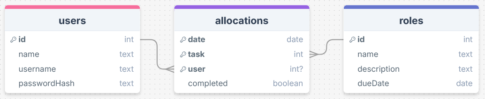
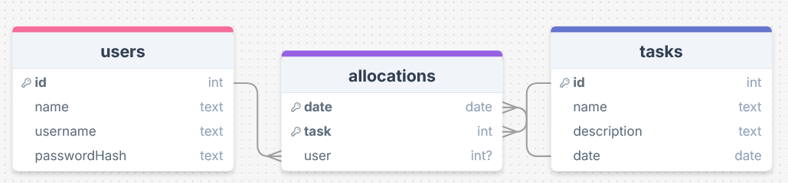
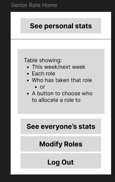
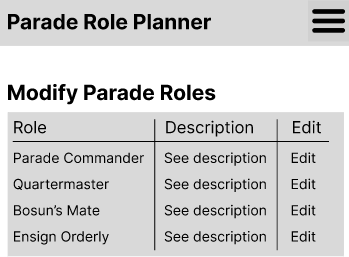
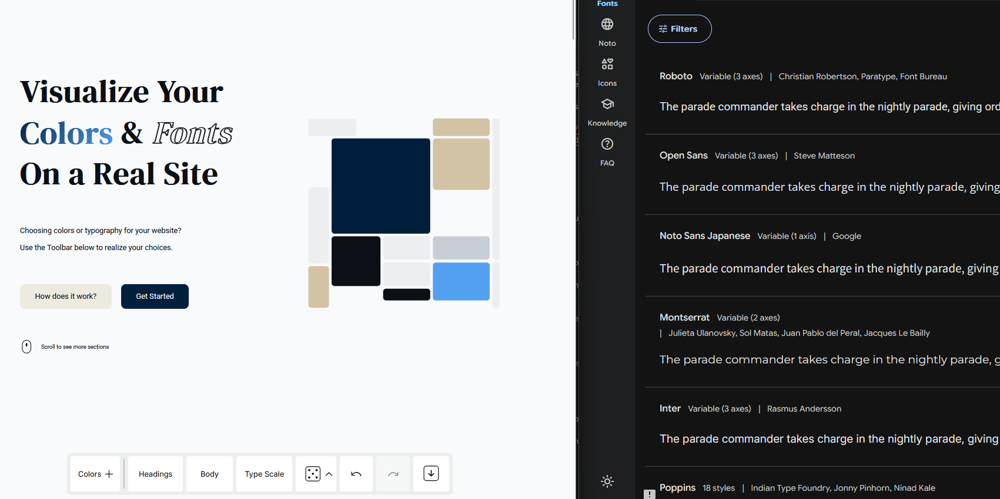

# Sprint 1 - A Working UI Prototype

## Sprint Goals

Develop a prototype that simulates the key functionality of the system, then test and refine it so that it can serve as the model for the next phase of development in Sprint 2.

[Figma](https://www.figma.com/) is used to develop the prototype.

---

## Initial Database Design

This is my inital design for my database. It has tables for users and tasks, and an allocations table to allow a 'many-to-many'-type relation betwen them. This allows many people to be allocated to a given role for a given week.
All of the tables can have entries with data I think is relevant to the use case.

I showed and explained this to some of the officers at my unit, and they raised some good points:
> - Once roles have been allocated, people getting them done isn't an issue we face, so you don't need to track whether that role has been completed.
> - What users that need to be admins?
> - We only want one person allocated to a role each week, so the system you have to allocate multiple people to a role isn't neccesary.
> - Roles are the same each week, so the roles table doesn't need to track the date.

## Updated Database Design

As such, I've removed the `completed` boolean column from roles, added an `admin` column to users, removed `user` from the compound primary key in allocations, and removed the date stamp from roles:

### Required Data Input

Data inputs depend on which end-user group the user is part of:

- All users will be able to accept a parade role for a given week
- Senior rates and officers will also be able to add, modify, and delete existing roles via forms.

### Required Data Output

- For the statistics pages, my site needs to show how many times that user as done each role in a logical format - perhaps a calender-heatmap-style display?

### Required Data Processing

- Data will have to be grouped by week and sorted either alphabetically or in some custom order - whichever my end-users will find easiest.

- New allocations will have to be made each week Wednesday at midnight - these will start with no user associated.

- For the statistics pages, past records of when that user did each role will have to be proccessed to be displayed appropriately and logically.

---

## UI 'Flow'

The first stage of prototyping was to explore how the UI might 'flow' between states, based on the required functionality.

This [Figma demo](https://www.figma.com/proto/rVOozVsAbJGSwktdN4QJWn/Cadet-Roles-App-Basic-Flow?node-id=0-1&t=2GvJXL3CwSX8vso3-1) shows the initial design for the UI 'flow':

<iframe style="border: 1px solid rgba(0, 0, 0, 0.1);" width="350" height="550" src="https://embed.figma.com/proto/rVOozVsAbJGSwktdN4QJWn/Cadet-Roles-App-Basic-Flow?node-id=1-3&p=f&scaling=scale-down&content-scaling=fixed&page-id=0%3A1&starting-point-node-id=1%3A3&embed-host=share" allowfullscreen></iframe>

### Testing

I showed both my officers and junior rates the basic flow. They noted that there actually isn't any way to see a role's description from the homne page, so I'll need to add that. Otherwise, they agreed that it seemed easy enough to use, though multiple people noted that buttons on the senior rates / officers page would be better off up in the nav bar:

This navbar comment didn't come as a suprise, as the flow mockup is only meant to show flowing between pages.

As these were the only criticisms - and I can only get quality end-user feedback once per week - I don't feel the need to make a version two of my UI Flow mockup. In line with the above feedback, I'll move on to developing the UI layout for each page of my site.

---

## Initial UI Prototype

The next stage of prototyping was to develop the layout for each screen of the UI.

This [Figma demo](https://www.figma.com/proto/vGYBN6UJJcOTnVgUnrWYUR/Cadet-Roles-App-Prototype-Mockup-v1?node-id=2001-2&p=f&t=yRN5VznPcrYRBL8S-1&scaling=scale-down&content-scaling=fixed&page-id=0%3A1&starting-point-node-id=2001%3A2) shows my initial layout design for my site's UI:

<iframe style="border: 1px solid rgba(0, 0, 0, 0.1);" width="350" height="650" src="https://embed.figma.com/proto/vGYBN6UJJcOTnVgUnrWYUR/Cadet-Roles-App-Prototype-Mockup-v1?content-scaling=fixed&kind=proto&node-id=2001-2&page-id=0%3A1&scaling=scale-down&starting-point-node-id=2001%3A2&embed-host=share" allowfullscreen></iframe>

### Testing

I showed this UI prototype to both of my end user groups, and they had a few points of feedback:
#### General feedback:
> The dropdown menu is nice to use

> There needs to be a way to un-allocate myself from a role in case I can no longer make it

> The font size is mismatched badly on the role allocation tables

> I didn't realise that you could click roles to see the description

This last feedback brings up a good point about the relevant implication of **usability** - *how easy to use my site is for the end-user, without the need for help or guidance*. Even though I thought the underlined text made it clear it was a link that could be followed, not all my end users realised that - and ultimately, that's what matters. I will address this by adding text saying 'click for info.' This, combined with the underline, should make it clear that it is a link the user can follow.

#### Senior rate- / officer-specific feedback 
> Selecting from a list for allocating someone to a role works here because you only have four cadets - but we have nearly 20. There needs to be a search, or maybe a way to filter by rank

The 'filter by rank' idea brought up a conversation about whether the database needs to store rank information. Eventually we decided against it - for now at least - and to simply store rank information in the user's display name. I therefore need to add a way for users to edit their own display names.

> On the modify role description page, the many 'see descriptions' look ugly. I know we want this designed with mobile phones in mind, but perhaps it could display a preview of the description instead of 'see description'.

The above point is in reference to this page of the design:

> I think it would be better to have every role's description on one page for everyone to view, that way they could understand all the roles at once. Could you make it automatically highlight the role the user clicked on, though?

### Changes / Improvements

Based on the above end-user feedback, I have updated my UI by:

- Adding a way to un-allocate yourself / the current person (for senior rates / officers)
- Adding search box for people's names when seniors rates / officers are allocating someone a role
- Improving the vertical stack of *see description*s by showing a preview
- Making it so that clicking on a role from the allocation home page shows all the roles instead of just one
- Adding a way for users to edit their name.

<iframe style="border: 1px solid rgba(0, 0, 0, 0.1);" width="350" height="650" src="https://embed.figma.com/proto/JtkNGGN07Hv2EOFoRztA5h/Cadet-Roles-App-Prototype-Mockup-v2?node-id=2001-2&scaling=scale-down&content-scaling=fixed&page-id=0%3A1&starting-point-node-id=2001%3A2&embed-host=share" allowfullscreen></iframe>

I showed this improved UI design to both end user-groups and this was their feedback:

#### Junior Rate-Specific Feedback
> The un-allocate 'X' button makes sense and is in a good spot

> I know the website doesn't need to be fun but it needs some life to it. Perhaps some colour and a different font?

### Senior Rate- / Officer-Specific Feedback

> The changes pertaining to role allocation are all good. I'm not sure if it's your intention or if it will work in practice but having the search act as a filter for names would be ideal.
Note that they were also happy with the un-allocate 'X' button - I showed them the one on the junior rate page as due to Figma limitations I couldn't make it work with the person selection on the senior rate / officer page.

> The new role description preview (image below) is better, but I just want a way to see the entire description without clicking anything.

I asked my commanding officer what colours and fonts he wanted the site to have (he *is* the boss) and he said, "suprise me." For my next iteration, I will add colours and possibly change the font, keeping somewhat within a Navy theme.

### Further Development

Seeing as my commanding officer is happy with anything, I've sat down with a couple of junior rates and worked out some good colours and fonts to trial.

I've done this by playing around with [Realtime Colours](https://www.realtimecolors.com/) and [Google Fonts](https://fonts.google.com):

I've come up with a colour scheme and font choice to test on my next figma mockup.

---

## Refined UI Prototype

<!-- Make each role show a paragraph description under the title for this revision -->

Having established the layout of the UI screens, the last thing my prototype needs is colour and font.

This Figma demo shows the colours and fonts applied:

<iframe style="border: 1px solid rgba(0, 0, 0, 0.1);" width="350" height="650" src="https://embed.figma.com/proto/6kvwIkLbuEJYMSiX5c1CHj/Cadet-Roles-App-Prototype-Mockup-v3?node-id=6009-71&p=f&scaling=scale-down&content-scaling=fixed&page-id=0%3A1&starting-point-node-id=6009%3A71&embed-host=share" allowfullscreen></iframe>

### Testing

I showed this to most of my unit and the general consensus was that:
- The new body text font (Roboto) is an improvement from before in terms of aesthetics and readability
- The navy blue primary colour is aesthetically pleasing
- The display font (DM Serif Display) doesn't feel right. It looks more like something you'd see on a newpaper site.
- The peach-coloured background accents are *alright* but also don't quite feel right. I think I'm on the right track for this one - it might be as simple as lowering the saturation.

### Changes / Improvements

After having another good sit-down with my end-users, we've decided on some final (at least until the refinement stage of the project) fonts and colours. These can be seen in the below demo:

<iframe style="border: 1px solid rgba(0, 0, 0, 0.1);" width="350" height="650" src="https://embed.figma.com/proto/6dRkM1cbCwnDfbAjHtKBNV/Cadet-Roles-App-Prototype-Mockup-v4?node-id=6009-71&p=f&scaling=scale-down&content-scaling=fixed&page-id=0%3A1&starting-point-node-id=6009%3A71&embed-host=share" allowfullscreen></iframe>

---

## Sprint Review

I'm quite happy with how my prototype has turned out, and where the project is sitting as a whole. Overall, the iterative design process has helped me develop a mockup that both me and my end-users are happy with. While some of the feedback was a little unspecific, this was to be expected, and I've been able to work around it to figure out exactly what my end-users want and need.