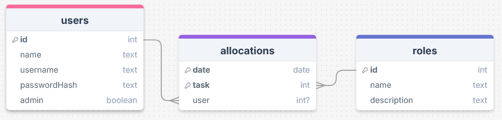

# Sprint 1 - A Working UI Prototype

## Sprint Goals

Develop a prototype that simulates the key functionality of the system, then test and refine it so that it can serve as the model for the next phase of development in Sprint 2.

[Figma](https://www.figma.com/) is used to develop the prototype.

---

## Initial Database Design

This is my inital design for my database. It has tables for users and tasks, and an allocations table to allow a 'many-to-many'-type relation betwen them. This allows many people to be allocated to a given role for a given week.
All of the tables can have entries with data I think is relevant to the use case.

I showed and explained this to some of the officers at my unit, and they raised some good points:
> - Users will need a username and password to log in to the system
> - Once roles have been allocated, people getting them done isn't an issue, so you don't need to track whether that role has been completed.
> - Only one person can get allocated to a role each week, so the system you have to allocate multiple people to a task isn't neccesary.

As such I've updated the users table to enable a login system, removed the 'done' bool from allocations, and removed 'user' from the conjoint primary key from allocations, as this system isn't needed. I've also changed 'dueDate' to 'date' - this is a small change but it reflects, as per the feedback, the change from thinking about role allocations as tasks to be completed to thinking about them as an entry of when something will happen / happened:

### Required Data Input

Data inputs depend on which end-user group the user is part of:

- All users will be able to accept a parade role for a given week
- Senior rates and officers will also be able to add, modify, and delete existing roles via forms.

### Required Data Output

- For the statistics pages, my site needs to show how many times that user as done each role in a logical format - perhaps a calender-heatmap-style display?

### Required Data Processing

- Data will have to be grouped by week and sorted either alphabetically or in some custom order - whichever my end-users will find easiest.

- New allocations will have to be made each week Wednesday at midnight - these will start with no user associated.

- For the statistics pages, past records of when that user did each role will have to be proccessed to be displayed appropriately and logically.

---

## UI 'Flow'

The first stage of prototyping was to explore how the UI might 'flow' between states, based on the required functionality.

This [Figma demo](https://www.figma.com/proto/rVOozVsAbJGSwktdN4QJWn/Cadet-Roles-App-Basic-Flow?node-id=0-1&t=2GvJXL3CwSX8vso3-1) shows the initial design for the UI 'flow':

<iframe style="border: 1px solid rgba(0, 0, 0, 0.1);" width="350" height="550" src="https://embed.figma.com/proto/rVOozVsAbJGSwktdN4QJWn/Cadet-Roles-App-Basic-Flow?node-id=1-3&p=f&scaling=scale-down&content-scaling=fixed&page-id=0%3A1&starting-point-node-id=1%3A3&embed-host=share" allowfullscreen></iframe>

### Testing

I showed both my officers and junior rates the basic flow. They agreed that it seemed easy enough to use, though multiple people noted that buttons on the senior rates / officers page would be better off up in the nav bar:

This didn't come as a suprise, as the flow mockup is only meant to show flowing between pages. As this was the only criticism - and I can only get quality end-user feedback once per week - I don't feel the need to make a version two of my UI Flow mockup. In line with the above feedback, I'll move on to developing the UI layout for each page of my site.

---

## Initial UI Prototype

The next stage of prototyping was to develop the layout for each screen of the UI.

This [Figma demo](https://www.figma.com/proto/vGYBN6UJJcOTnVgUnrWYUR/Cadet-Roles-App-Prototype-Mockup-v1?node-id=2001-2&p=f&t=yRN5VznPcrYRBL8S-1&scaling=scale-down&content-scaling=fixed&page-id=0%3A1&starting-point-node-id=2001%3A2) shows my initial layout design for my site's UI:

<iframe style="border: 1px solid rgba(0, 0, 0, 0.1);" width="350" height="650" src="https://embed.figma.com/proto/vGYBN6UJJcOTnVgUnrWYUR/Cadet-Roles-App-Prototype-Mockup-v1?node-id=2021-46&p=f&scaling=scale-down&content-scaling=fixed&page-id=0%3A1&starting-point-node-id=2001%3A2&embed-host=share" allowfullscreen></iframe>

### Testing

I showed this UI prototype to both of my end user groups, and they had a few points of feedback:
#### General feedback:
> The dropdown menu is nice to use

> There needs to be a way to un-allocate myself from a role in case I can no longer make it

#### Senior rate / officer -specific feedback 
> Selecting from a list for allocating someone to a role works here because you only have four cadets - but we have nearly 20. There needs to be a search, or maybe a way to filter by rank

The 'filter by rank' idea brought up a conversation about whether the database needs to store rank information. Eventually we decided against it - for now at least - and to simply store rank information in the user's display name. I therefore need to add a way for users to edit their display name.

> On the modify role description page, the many 'see descriptions' look ugly. I know we want this designed with mobile phones in mind, but perhaps it could display a preview of the description instead of 'see description'.

The above point is in reference to this page of the design:

### Changes / Improvements

Based on the above end-user feedback, I have updated my UI by adding:

- [ ] A way to un-allocate yourself / the current person (for senior rates / officers)
- [x] A search box for people's names when seniors rates / officers are allocating someone a role
- [ ] Confirmation messages when alocating a role to self / someone else
- [ ] An improvement on the vertical stack of *see description*s

Replace this text with notes any improvements you made as a result of the testing.

*FIGMA IMPROVED PROTOTYPE - PLACE THE FIGMA EMBED CODE HERE - MAKE SURE IT IS SET SO THAT EVERYONE CAN ACCESS IT*

---

## Refined UI Prototype

Having established the layout of the UI screens, the prototype was refined visually, in terms of colour, fonts, etc.

This Figma demo shows the UI with refinements applied:

*FIGMA REFINED PROTOTYPE - PLACE THE FIGMA EMBED CODE HERE - MAKE SURE IT IS SET SO THAT EVERYONE CAN ACCESS IT*

### Testing

Replace this text with notes about what you did to test the UI flow and the outcome of the testing.

> The site needs some life to it. It could do with colour and maybe a different font.

### Changes / Improvements

Replace this text with notes any improvements you made as a result of the testing.

*FIGMA IMPROVED REFINED PROTOTYPE - PLACE THE FIGMA EMBED CODE HERE - MAKE SURE IT IS SET SO THAT EVERYONE CAN ACCESS IT*

---

## Sprint Review

Replace this text with a statement about how the sprint has moved the project forward - key success point, any things that didn't go so well, etc.

