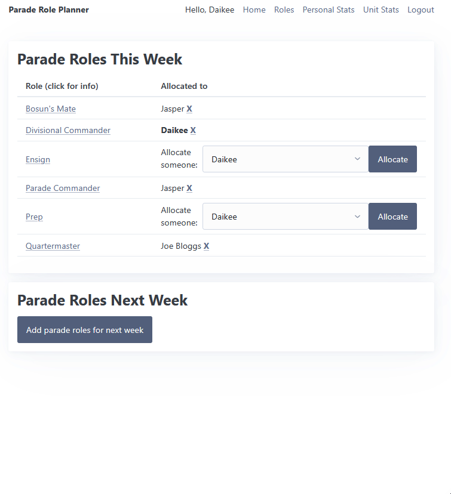

# Sprint 2 - A Minimum Viable Product (MVP)

## Sprint Goals

Develop a bare-bones, working web application that provides the key functionality of the system, then test and refine it so that it can serve as the basis for the final phase of development in Sprint 3.

---

## Implemented Database Schema

This is the database schema I have implemented for the my MVP. As detailed in the Sprint 1 documentation, me and my stakeholders are still debating adding a rank field to the users table, as opposed to just storing the user's rank as part of their name.

---

## Initial Implementation

The key functionality of the web app was implemented:

Only admins can see this one. She ain't pretty

---

## Testing allocations

The allocations page should work correctly. Junior NCOs should be able to allocate and remove themselves from a role, while admins should be able to allocate anyone, as well as generate a new set of roles for the upcoming weeks.

I'll start by testing that **junior NCOs** can allocate and remove themselves from roles:

The allocation process works correctly, though the grammar mistake highlighted in the GIF needs to be fixed.

I'll now test that **admins** can create roles for an upcoming week, allocate, and remove people:

Everything works as intended here.

### Changes / Improvements

I have corrected the grammar mistake so that it reads "*No parade roles have been put up for next **week***" instead of "*No parade roles have been put up for next*"

---

## Testing creation, editing, and deletion of roles

As seen in one of the above images, all the existing roles are displayed correctly. I will test that admins can create, edit, and delete roles:

As the GIF shows, creating, editing, and deleting roles works as intended. No modifications need to be made here.

---

## Testing personal stats

I need to check that the personal statistics are being counted correctly. To do this, I will take a before screenshot, allocate myself to some roles, wait a week (so the allocation falls into the *past 10 weeks*), and compare with an after screenshot.

I've allocated myself to ensign and prep, so these should be incremented in a weeks time:

As can be seen, it increments correctly. While the display isn't particually visually appealing or easy to read, it fulfills the requirements of an MVP.

---

## Testing unit stats

Firstly, I need to test that only admins can see this page:

This works as intended. However when taking a closer look at the actual data shown, we see some issues:

1. There is no logical order to how everything is laid out - it should be by date, then alphabetically by role.
2. As of this image, the date is 2025-09-21 - meaning the allocations shown for 2025-09-23 and 2025-09-30 are for the future and shouldn't be displayed here.

### Changes / Improvements

1. I have ordered the stats by date, then alphabetically by role.
2. I have added a condition (`if current_date > allocation_date`) in my python code to exclude allocations that haven't happened yet.

---

## Testing FEATURE NAME HERE -----------------------

Replace this text with notes about what you are testing, how you tested it, and the outcome of the testing

**PLACE SCREENSHOTS AND/OR ANIMATED GIFS OF THE TESTING HERE**

### Changes / Improvements

Replace this text with notes any improvements you made as a result of the testing.

**PLACE SCREENSHOTS AND/OR ANIMATED GIFS OF THE IMPROVED SYSTEM HERE**

---

## Sprint Review

Replace this text with a statement about how the sprint has moved the project forward - key success point, any things that didn't go so well, etc.

