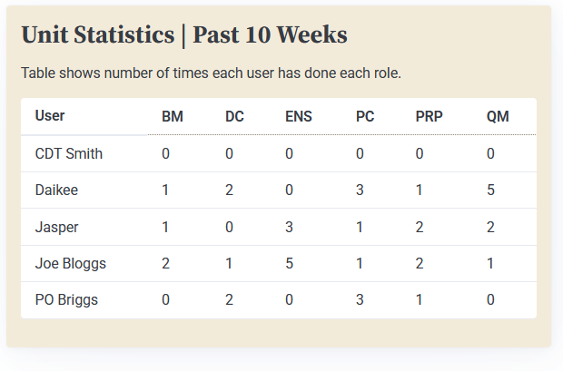

# Sprint 3 - A Refined and Complete System

## Sprint Goals

Develop the system until it is fully featured, with a refined UI that satisfies the requirements. The system will be fully tested at this point.

---

## Updated Database Schema

After fitting the site to mobile devices, we have a problem on the unit stats page:

I tried rotating the headings to get the to fit, but even this didn't work:

As such, I've spoken with the officers and they think that assigning each role a short abbreviation is best. This should be fine, as the only people with access to this page will know what each abbreviation is - but, considering my relevant implication of accessibility, I will add a tooltip when hovering just in case someone isn't sure.

As such, I've updated my database to give each role an abbreviation:

---

## Updated Colour Scheme

Now that my website was fully functional, it was time to add colour. 

I showed the final colour scheme to my end-users:

While they all liked the colour, some end-users, especially some officers, found it hard to read - meaning I had an accessibility problem. To maximise accessibility while keeping the aesthetically pleasing colour scheme, I have made the table itself white to maximise contrast, while keeping the peach border:

My end-users were all in support of this change.

## Final Implementation

My website is fully implemented with a refined UI:

Note how with the above roles image, we've decided to have the peach colour throughout instead of a white insert - this is based on end-user feedback.

---

## Testing Features

I'll now go through and test all my website's features. Similarly to the testing in sprint 2, I'll be testing the functionality, but here I'll also be testing the user experience in terms of usability and aesthetics.

## Testing allocations

The allocations page should work correctly. Junior NCOs should be able to allocate and remove themselves from a role, while admins should be able to allocate anyone, as well as generate a new set of roles for the upcoming weeks. One requirement for this page that was dropped was the search function for admins when allocating a cadet - I discussed with the senior rates and officers, and they decided that due to the size of the unit (10-15 cadets), the search wasn't necessary as it's easy to identify and pick a cadet from the dropdown list.

Like in sprint 2, I'll start by testing that **junior NCOs** can allocate and remove themselves from roles:

Both allocation and deallocation work as intended. The interface is also simple to use and aesthetically pleasing.

I'll now test that **admins** can create roles for an upcoming week, allocate, and remove people:

As above, everything is functional and looks good.

---

## Testing creation, editing, and deletion of roles

As can be seen in the second image in the Final Implementation section above, all the roles display correctly. I'll test that admins can easily create, edit, and delete roles:

We can see that everything works correctly. Also note the confirmation popup before deletion.

---

## Testing personal stats

I need to check that the personal statistics are being counted correctly. To do this, I will take a before screenshot, allocate myself to a role, wait a week, and check that all entries in the "last done" column have incremented by a week.

Before:

I've assigned myself to ensign, so if everything works that should read "last week" in a week's time.

After:

As can be seen by comparing the images, everything has incremented correctly, and the results are displayed logically.

---

## Testing unit stats

I need to test that 1. only admin accounts can view this page, and 2. the data is presented to the user in a logical and readable format.

The functionality is all here - only admins can view the page, the data is displayed in table form, and the tooltips show when hovering over the table headings.

I showed this to some of the officers likely to be using the table, and they really liked how it looked, but the one problem brought up is that the table needs a key explaining what the numbers mean - even though it makes sense to me, it might as well be a table of random numbers to someone that hadn't received an explanation.

To remedy this, I've added a short explanation above the table:

---

## Testing account creation and name editing

I need to test that new accounts can be created properly, and that users can edit their account's display name. I also need to check that everything looks as it should:

Already, we can see that things aren't displaying correctly - though it's difficult to see in the screenshot, the "Log in to continue" text is displayed in white above the peach box, but this is meant to be black and also in front of the peach background.

### Changes / Improvements

I've done some fixes in my CSS styling - now, I'll make sure that everything else works properly:

As the above gif shows, registration, login, and name editing work as intended, and the process is also functionally simple and aesthetically pleasing.

## Testing mobile view

Throughout the development of my website, I've made my design with mobile devices in mind. In theory, this should mean the same desktop interface will also work on mobile - but I'll test it to be sure:

It seems that nearly everything works properly, with two caveats - first, the nav dropdown goes slightly off the screen, making it difficult to read and interact with, and second, the table on the unit stats display requires scrolling, and while this isn't a problem, only the table should scroll - not the entire page.

### Changes / Improvements

I've fixed the above issues:

However the tooltips are now broken, as they get clipped off by the scroll container. I've fixed this with javascript by generating absolutely positioned div elements in front of the table headings, and these divs hold the tooltip:

After getting my stakeholders to rigorously test the mobile site, none of them could find any other issues, and all thought it was well-usable and aesthetically pleasing, even on a small screen.

## Testing dark mode

Finally, I need to test my website's dark mode. Though I didn't explicitly design with this in mind, the default dark mode colour scheme (with some minor improvements) was, according to my dark-mode-enjoying users, exactly what they wanted - basic, minimalist, and clear:

---

## Sprint Review

Through this sprint, I've progressively refined my website's feature set and design up to the point where both me and my stakeholder groups are very happy with the end result. I've also tested all my website's features, and though some issues were identified, they have all been fixed.

