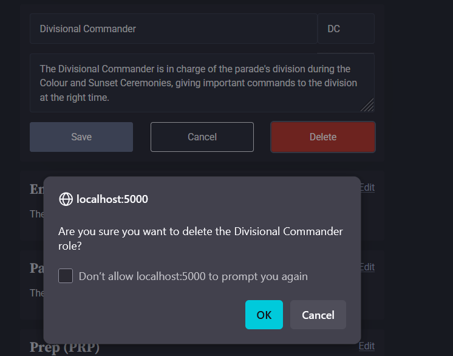

# Project Review

## Addressing Relevant Implications

### Accessibility

Accessibility in this project has been about making sure everyone, regardless of ability and device, can use my site.

Throughout the development process, I've designed with mobile devices in mind, meaning that the layout is just as easy to use on a phone as it is a computer. To make sure my site works on all devices, including older ones that may not be able to correct semantic HTML mistakes, I've also validated all my pages with the W3C Markup Validation Service.

I've made sure to use colour to supplement, and not be the distinguishing feature, of user inputs like buttons - for example, the role delete button is red, which may be indistinguishable from green to a colourblind person - but the red is only one indication of the button's purpose - it says "delete", and a confirmation popup also shows:

I've selected a readable font size and confirmed with end-users (including older officers with impaired vision) that my site is easy to read and that buttons are big enough to comfortably press on both the desktop and mobile layouts.

### Functionality

To make sure my website works as intended and expected by my end-users, I've placed a big focus on gathering feedback and making relevant changes, and this can be seen through all three of my development sprints.

I got users from both end-user groups to do a final test to make sure everything works logically, removing bias from me who understands everything.

I, along with my end-users, have also thoroughly checked that everything is bug-free.

### Ethics

One of the purposes of my website is to allocate parade roles more fairly. At the beginning of my project, I considered adding a warning message when allocating the same user for the same role too regularly. Often, though, there is a good reason for someone to be repeating the same role, so I've instead decided that the table on the unit statistics page is the best way for senior rates / officers to allocate roles fairly where possible.

I've also made sure that the language on the personal statistics page isn't demeaning - e.g., it says "role last done 7 weeks ago," rather than "you are not pulling your load with this role."

### Aesthetics

When I was prototyping my design in sprint 1 and refining it in sprint 3, I was continuously working with my end-users to make sure that my choices of colour scheme, fonts, and element positioning were aesthetically pleasing, while still being functional and accessible.

Some end-users will also prefer a dark-mode interface, so to please them I've made my site dark-mode compatible.

### Usability

Throughout prototyping and development, I've sought end-user feedback to maximise my website's ease of use and predictability. When I made design choices, I evaluated these against Nielsen's usability heuristics (UX principles):

- Consistency and Standards - I've stuck to established conventions, such as positioning the nav bar at the top of the page and using widely understood icons
- Error prevention - When committing to an irreversible action, such as deleting a role, a confirmation popup is shown to give users an escape from mis-clicks.
- Aesthetic and Minimalist Design - I've made sure that my site's design is simple and displays only the necessary information, depending on whether the user is a junior or senior rate / officer.

---

## Overall Review

My end-users and I are very happy with how this site has turned out - functional, simple, and good-looking.

I'm especially happy with the 3-sprint development process - taking the development one step at a time allowed me and my end-users to maximise the functionality and user experience in a gradual yet clear way. I'm also happy that I used git for version control - I leveraged the ability to look back in time to grab code and database entries from previous iterations, saving me time.

One thing that didn't quite go as I would have liked was the functionality of the Figma mockups in the prototype phase - while Figma does technically have support for complex, multi-layered, interactive interfaces, developing one to the level of fidelity I wanted to show my end users would've taken too long, so I instead had to make some simplifications.

The end-user testing and trialling had a large impact on the final outcome - there were a lot of things, both minor bugs and major design points, that I missed or didn't think of, that my end users helped correct and enhance.

If I could go back in time and do it differently, I'd consider from the initial prototype stage how my site will look in dark mode. I added support toward the end of the development, and though it did work out well, I'm not quite as happy with it as I am with my light mode interface.